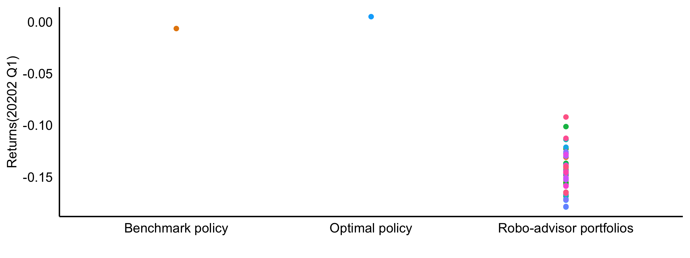
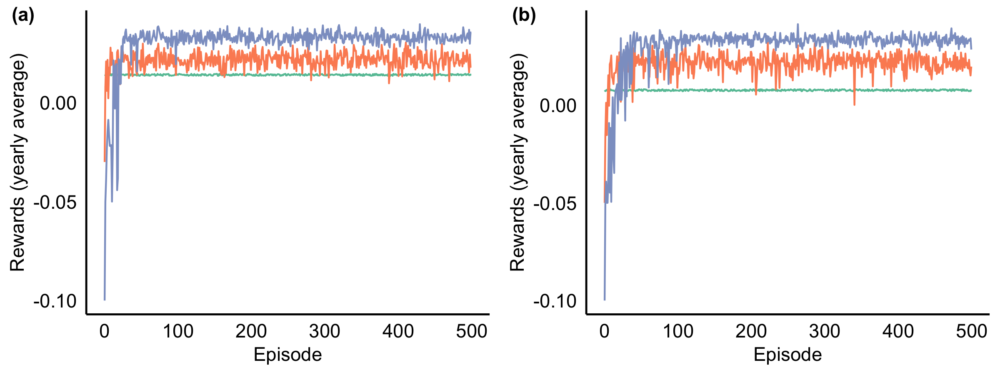
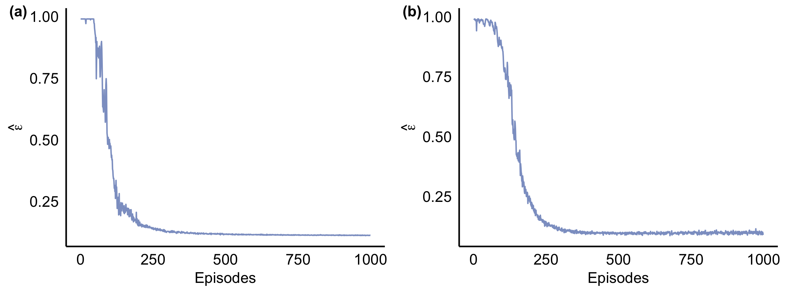
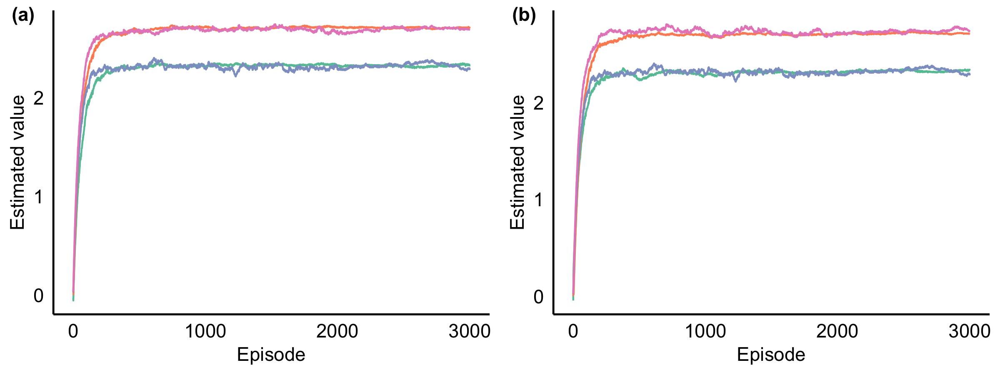

[](http://quantlet.de/)

## [](http://quantlet.de/) **DEIS** [](http://quantlet.de/)

```yaml

Name of Quantlet: 'DEIS'

Published in: 'RoboAdvisors'

Description: 'We propose a novel algorithm SARSA-IS to optimise the investment strategy under rare disasters.'

Keywords: 'Robo-advisors, reinforcement learning, policy control, rare disasters'

Author: 'Jiawen Liang, Cathy Chen, Bowei Chen'

Submitted:  '27. 07. 2022'


```







